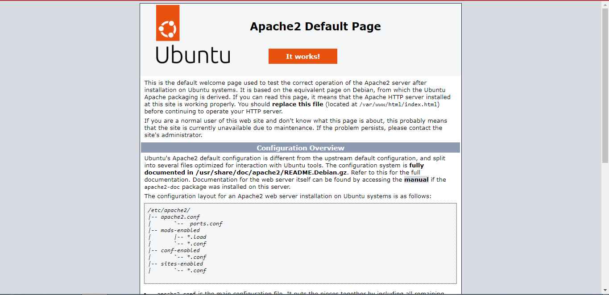
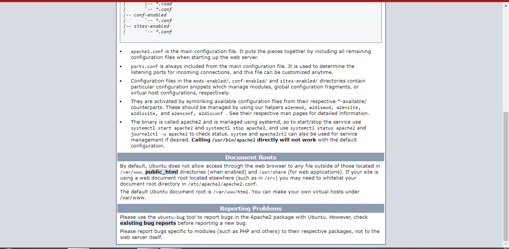

# Apache_Web_Server_Docker_Image

# Build Instructions

**1. Create a New Instance**

After the Docker playground instance is ready, click on the "Add New Instance" button on the left sidebar.
This will create a new Docker host for you to work with.

**2. Create a Dockerfile**

In the terminal window of the new instance, create a new file called Dockerfile by running the following command:

                        vi Dockerfile
This will open the nano text editor, where you can start writing your Dockerfile instructions.

**3. Write your Dockerfile**

In the editor, specify the instructions for building your Docker image. 

**4. Build the Docker Image**

In the terminal, run the following command to build the Docker image from the Dockerfile:

                    docker build -t my-apache-image .

Docker will start building the image based on the instructions in your Dockerfile.

**5. Verify the Built Image**

After the build process completes, you can verify that the image was created by running:

                      docker images
You should see your newly built image listed in the output.

**6. Run a Container from the Image**

To run a container based on the image you just built, use the following command:

                    docker run -d -p 80:80 my-apache-image

**7. Test the Container**

Find the IP address of the Docker host by running:

                      ip addr show

You should see the Apache default page, indicating that your Docker container is running and serving the Apache web server.

# Screenshots

 The following screenshots visually demonstrates the successful execution of my project

 

 
 

 
